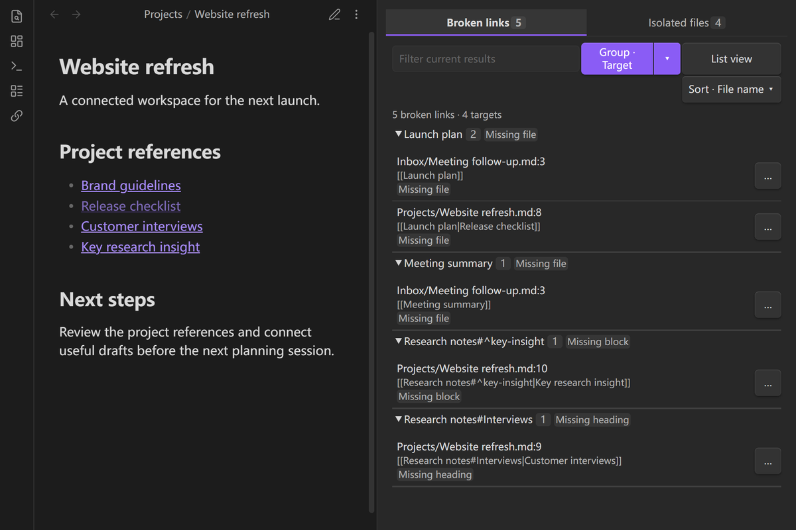
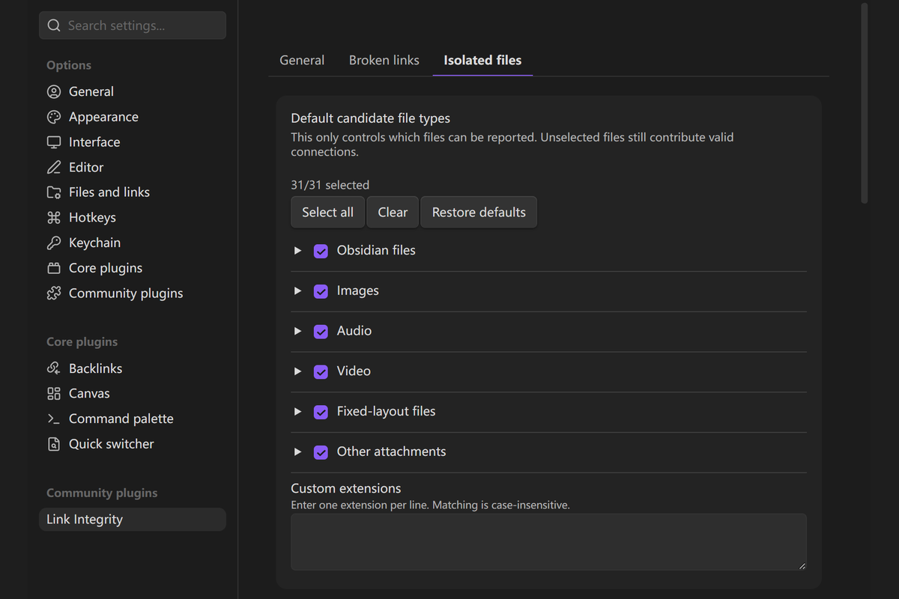

# Link Integrity

[English](../../README.md) · [简体中文](README.zh-CN.md) · [繁體中文](README.zh-TW.md) · [Deutsch](README.de.md) · [Français](README.fr.md) · [Русский](README.ru.md) · [Português (Brasil)](README.pt-BR.md) · [日本語](README.ja.md) · [한국어](README.ko.md) · [Español](README.es.md) · [Tiếng Việt](README.vi.md)

Link Integrity es un complemento de diagnóstico local y de solo lectura para Obsidian, centrado en Broken links e Isolated files.

## Capturas de pantalla

Revisa enlaces rotos y archivos aislados en una barra lateral compacta:

Configura el índice, las reglas de exclusión, los tipos de archivo y el aislamiento esperado en los ajustes de Obsidian:

## Funciones

- Informa referencias internas rotas a archivos, encabezados y bloques desde Markdown, incrustaciones, Frontmatter, Canvas y referencias explícitas de archivo en Bases.
- Encuentra archivos sin conexión entrante ni saliente válida con otro archivo existente del Vault; los autoenlaces y las URL externas no crean conexiones.
- Marca con menor confianza los archivos aislados que contienen enlaces salientes rotos.
- Muestra opcionalmente notas periódicas, plantillas y archivos como Expected isolated sin inventar aristas.
- Filtra archivos de Obsidian, familias de imágenes, audio, vídeo, PDF y extensiones de adjuntos configuradas.
- Construye una base completa cuando hace falta y después aplica actualizaciones incrementales.
- Abre cada diagnóstico en su origen; todo el análisis y el índice permanecen locales.

Los resultados dinámicos de Bases no son aristas explícitas. Si el archivo se resuelve pero falta el encabezado o bloque, la conexión de archivo sigue siendo válida y se informa el subtrayecto por separado.

## Requisitos y compatibilidad

- Obsidian 1.12.7 o posterior.
- Diseñado para escritorio y móvil; cada host y dispositivo real conserva su propia frontera de aceptación.
- Solo diagnostica el Vault actual y no comprueba la web externa.

## Instalación

Tras la aprobación en el directorio de la comunidad, instala Link Integrity desde **Ajustes → Complementos de la comunidad → Explorar**. También puedes descargar `link-integrity-<version>.zip` desde la [última versión de GitHub](https://github.com/ZHYX91/obsidian-link-integrity/releases/latest).

Para una instalación manual, coloca `main.js`, `manifest.json` y `styles.css` en `Vault/.obsidian/plugins/link-integrity/`. Al actualizar, sustituye solo esos tres archivos y conserva `data.json` salvo que quieras restablecer los ajustes.

## Uso

1. Activa Link Integrity en los complementos de la comunidad.
2. Abre la barra lateral desde la cinta o la paleta de comandos y cambia entre **Broken links** e **Isolated files**.
3. Selecciona un diagnóstico para abrir su origen; los filtros solo cambian la vista actual.
4. Si el análisis inicial está desactivado o la base falló, usa **Crear índice** o **Reconstruir índice** en General. Después las actualizaciones incrementales mantienen los resultados al día.

## Ajustes

- **General**: idioma, análisis al inicio, agrupación y acciones de índice. El idioma predeterminado es **Seguir Obsidian**.
- **Broken links**: categorías de diagnóstico y reglas de exclusión con nombre y vista previa.
- **Isolated files**: tipos predeterminados, análisis opcional sin enlaces entrantes, visibilidad Expected isolated y reglas.
- Las reglas de aislamiento esperado combinan tipo, carpeta exacta o recursiva, formato de fecha, glob y expresión regular; el ajuste periódico cubre día, semana, mes, trimestre y año.

Los ajustes y reglas se guardan en `data.json`; el grafo derivado no se conserva.

## Limitaciones

- No elimina archivos ni reescribe enlaces automáticamente.
- Las URL externas no se solicitan a través de la red.
- Las consultas dinámicas de Bases no cuentan como conexiones explícitas.
- Las reglas Expected isolated solo afectan a la proyección de candidatos y nunca ocultan enlaces rotos.
- Las pruebas automatizadas no sustituyen la aceptación en versiones y dispositivos Obsidian reales.

## Privacidad y seguridad

Todo se procesa localmente. Link Integrity no sube el contenido del Vault, no requiere cuenta, no modifica notas ni conserva el grafo derivado.

## Desarrollo

Usa Node.js 24.18.0 y npm 11.16.0. Ejecuta `npm ci` y después `npm run check`.

Contratos estables: [producto](../product.en.md), [UX](../ux.en.md), [arquitectura](../architecture.en.md), [pruebas](../testing-strategy.en.md) y [publicación](../release.en.md). Las fuentes chinas correspondientes están en la misma carpeta.

## Soporte

Usa [GitHub Issues](https://github.com/ZHYX91/obsidian-link-integrity/issues) para errores reproducibles y solicitudes concretas. No publiques rutas del Vault, contenido de notas ni muestras privadas.

## Licencia

[MIT](../../LICENSE) © ZhengYX
