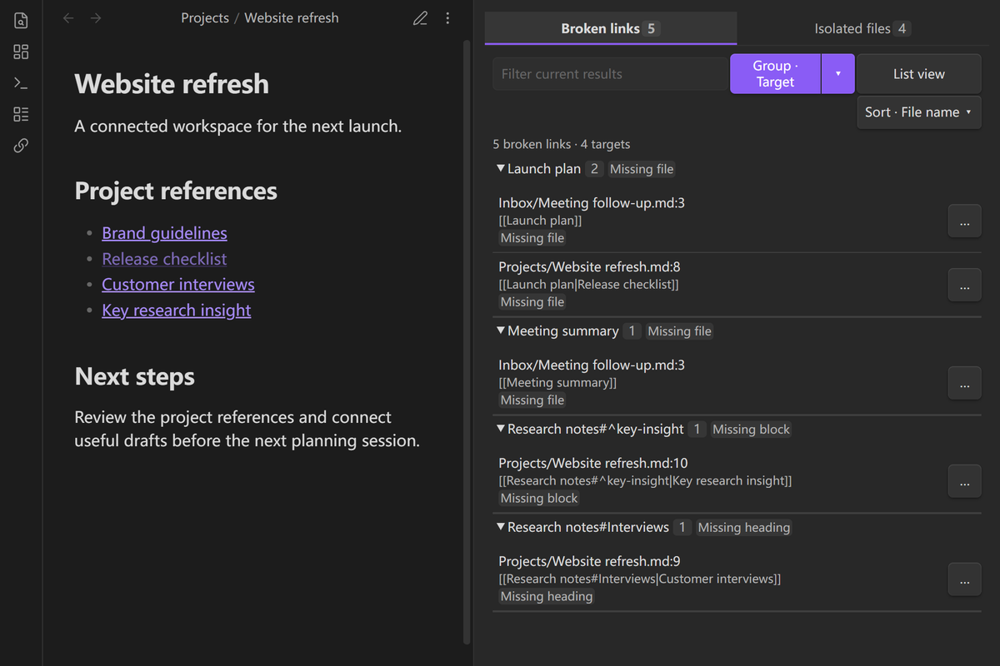
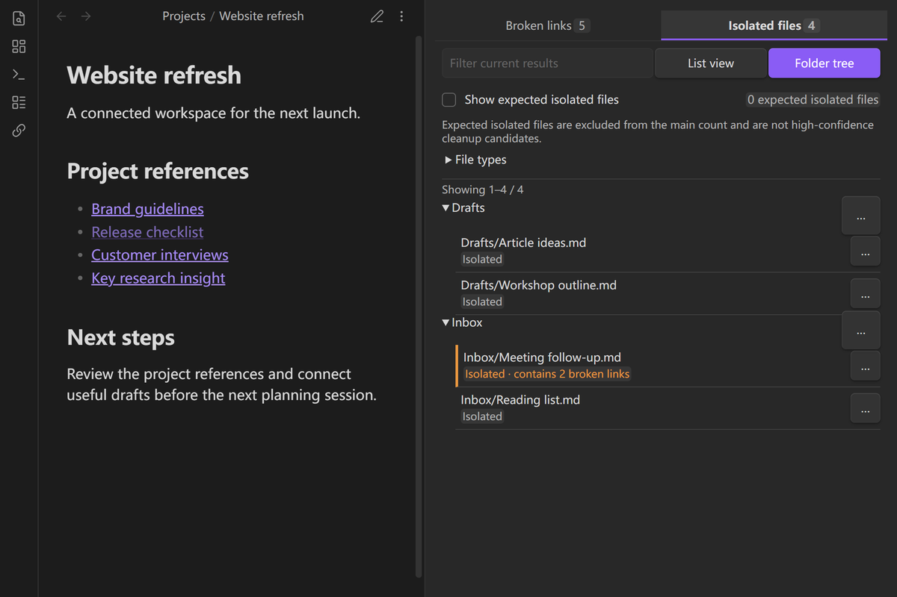
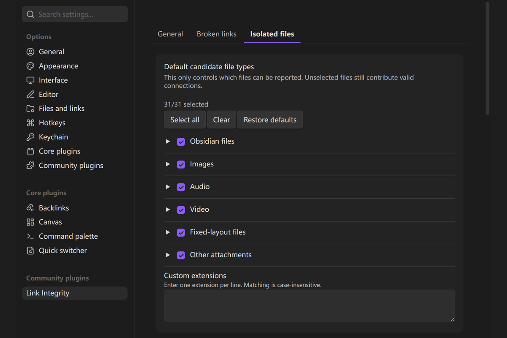

# Link Integrity

[English](../../README.md) · [简体中文](README.zh-CN.md) · [繁體中文](README.zh-TW.md) · [Deutsch](README.de.md) · [Français](README.fr.md) · [Русский](README.ru.md) · [Português (Brasil)](README.pt-BR.md) · [日本語](README.ja.md) · [한국어](README.ko.md) · [Español](README.es.md) · [Tiếng Việt](README.vi.md)

Link Integrity es un complemento local y de solo lectura para Obsidian que ayuda a encontrar Broken links e Isolated files.

## Capturas de pantalla

Revisa enlaces rotos y archivos aislados en una barra lateral compacta:

Gestiona el índice, las reglas de exclusión, los tipos de archivo y las reglas de aislamiento esperado en los ajustes de Obsidian:

## Funciones

- Encuentra enlaces internos a archivos, encabezados y bloques que faltan en Markdown, incrustaciones, Frontmatter, Canvas y referencias explícitas de archivo en Bases.
- Encuentra archivos sin ninguna conexión entrante o saliente válida con otro archivo existente del Vault. Los enlaces al propio archivo y las URL externas no cuentan como conexiones del Vault.
- Avisa cuando un archivo aislado también contiene enlaces salientes rotos, para no confundirlo con un archivo que claramente pueda eliminarse.
- Las notas periódicas, plantillas, archivos de archivo y elementos similares pueden marcarse como Expected isolated. Esto solo cambia su clasificación en los resultados; no altera sus enlaces reales.
- Filtra archivos aislados por archivos de Obsidian, formatos de imagen, audio, vídeo, PDF y extensiones de adjuntos configuradas.
- Construye un índice completo cuando hace falta y lo mantiene actualizado automáticamente a medida que cambia el Vault.
- Abre cada problema en su origen cuando hay navegación precisa disponible. El análisis y la indexación se realizan de forma local.

Los resultados dinámicos de Bases no se tratan automáticamente como enlaces. Si existe el archivo de destino pero falta un encabezado o bloque, los archivos siguen considerándose conectados y se informa por separado de lo que falta.

## Requisitos y compatibilidad

- Obsidian 1.12.7 o posterior.
- Compatible con Obsidian para escritorio y móvil.
- Solo comprueba el Vault actual. No revisa sitios web externos ni recursos remotos.

## Instalación

Abre **Ajustes → Complementos de la comunidad → Explorar**, busca **Link Integrity** e instálalo. Si todavía no aparece en el catálogo, descarga `link-integrity-<version>.zip` desde la [última versión de GitHub](https://github.com/ZHYX91/obsidian-link-integrity/releases/latest).

Para una instalación manual, coloca `main.js`, `manifest.json` y `styles.css` en `Vault/.obsidian/plugins/link-integrity/`. Al actualizar, sustituye solo esos tres archivos y conserva `data.json`, salvo que quieras restablecer la configuración.

## Uso

1. Activa Link Integrity en los complementos de la comunidad.
2. Abre Link Integrity desde la cinta o la paleta de comandos. La barra lateral contiene **Broken links** e **Isolated files**.
3. Selecciona un resultado para abrir su origen. Los filtros de archivos aislados solo cambian la vista actual y no modifican los valores predeterminados guardados.
4. El análisis al iniciar está desactivado de forma predeterminada. Al abrir la barra lateral, el índice se crea cuando es necesario; también puedes usar **Crear índice** o **Reconstruir índice** en General. Después de la primera creación correcta, los cambios del Vault actualizan los resultados automáticamente.

## Ajustes

- **General**: idioma, análisis al inicio, vistas predeterminadas y acciones para crear o reconstruir el índice. El idioma predeterminado es **Seguir Obsidian**.
- **Broken links**: qué problemas se muestran y qué reglas de exclusión con nombre se aplican, con vista previa de coincidencias.
- **Isolated files**: tipos de archivo predeterminados, vista opcional sin enlaces entrantes, Expected isolated, reglas de exclusión y reglas de aislamiento esperado.
- Las reglas de aislamiento esperado pueden combinar tipo de archivo, una carpeta o una carpeta con subcarpetas, formatos de fecha, patrones glob y expresiones regulares avanzadas. El ajuste de notas periódicas admite día, semana, mes, trimestre y año.

Los ajustes y las reglas del usuario se guardan en `data.json`. El índice de enlaces calculado se mantiene en memoria y se vuelve a crear después de reiniciar.

## Limitaciones

- Link Integrity no elimina archivos, no reescribe enlaces ni decide automáticamente qué debería borrarse.
- Las URL externas están fuera de alcance y nunca se consultan por la red.
- Los resultados dinámicos de Bases no cuentan como conexiones directas entre archivos; solo cuentan las referencias explícitas.
- Las reglas de aislamiento esperado solo cambian la clasificación de archivos que ya están aislados. No ocultan enlaces rotos ni eliminan conexiones reales.

## Privacidad y seguridad

La indexación y la evaluación de reglas se realizan localmente. Link Integrity no sube contenido del Vault, no requiere cuenta y no modifica notas. Las rutas y ejemplos de diagnóstico permanecen en la sesión actual de Obsidian salvo que decidas compartirlos.

## Desarrollo

Usa Node.js 24.19.0 y npm 11.17.0. Ejecuta `npm ci` y después `npm run check`.

Documentación para desarrollo: [producto](../product-requirements.en.md), [UX](../ux-spec.en.md), [arquitectura](../architecture.en.md), [pruebas](../testing-strategy.en.md). Las fuentes chinas correspondientes están en la misma carpeta.

## Soporte

- [Q&A](https://github.com/ZHYX91/obsidian-link-integrity/discussions/categories/q-a): Preguntas de uso y configuración.
- [Ideas](https://github.com/ZHYX91/obsidian-link-integrity/discussions/categories/ideas): Ideas de funciones y flujos de trabajo todavía en discusión.
- [Show and tell](https://github.com/ZHYX91/obsidian-link-integrity/discussions/categories/show-and-tell): Consejos, flujos de trabajo y ejemplos.

Usa [GitHub Issues](https://github.com/ZHYX91/obsidian-link-integrity/issues/new/choose) para errores reproducibles y solicitudes concretas. No publiques rutas privadas del Vault, contenido de notas, ejemplos de diagnóstico ni información personal.

## Licencia

[MIT](../../LICENSE) © ZhengYX
